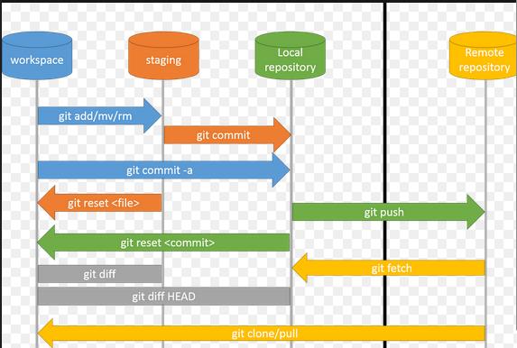

# Git

## Git Basics: A Simple Manual

Git is a version control system that helps you manage your code and collaborate with others. This manual will cover some basic Git commands to get you started.

#### Setting Up Git
- Install Git on your computer. You can download it from [here](https://git-scm.com/downloads) and follow the installation instructions.

#### Configuring Git
- After installation, set your name and email using the following commands:

```
git config --global user.name "Your Name"
git config --global user.email "your.email@example.com"
```

#### Creating a New Repository

- **Local Repository**: To start a new project with Git, create a new directory and navigate into it. Then run:

```
git init
```

> This step is better to be done on GitHub.

- **Clone Repository**: To work on an existing project, clone it from a remote repository using:
```
git clone <remote_url>
```

- **Switching Branches**: Create and switch to a new branch with:
```
git checkout -b <branch_name>
```

#### Basic Commands


- **Adding Files**: Stage changes for commit using:
```
git add <filename>
```

- **Committing Changes**: Save staged changes to your local repository with:

```
git commit -m "Your commit message"
```
Use `-a` to tell the command to automatically stage files that have been modified and deleted. So, you don't need to use `git add` anymore. For new files, `git add` should be used.

```
git commit -am "Your commit message"
```

#### Collaboration

- **Pushing Changes**: Upload your local commits to a remote repository using:

```
git push origin <branch_name>
```

- **Pulling Changes**: Retrieve and merge changes from the remote repository with:

```
git pull origin <branch_name>
```

#### View Commands

- **Checking Status**: To see which files are staged or modified, use:
```
git status
```

- **Viewing Commit History**: See a list of past commits using:
```
git log
```



## Git Advanced

### Git LFS (Large File Storage) Guide

Git LFS is a tool that helps manage large files in Git repositories efficiently. It stores large files (like images, videos, etc.) outside the repository while keeping references to them in your version control system. This reduces the size of your Git repository and optimizes performance.

#### Step 1: Install Git LFS

To begin using Git LFS, you need to install it on your system:

```bash
sudo apt install git-lfs
```

#### Step 2: Initialize Git LFS in Your Repository

After installation, you need to enable Git LFS in your project:

```bash
git lfs install
```

Now, your Git repository is ready to handle large files.


#### Step 3: Track Large Files

Specify which file types or individual large files you want Git LFS to track.

- **Track by Extension**: To track all files with a certain extension (e.g., `.psd`), use:

```bash
git lfs track "*.psd"
```

This will automatically add a line in the `.gitattributes` file, ensuring all `.psd` files are managed by Git LFS:

```
*.psd filter=lfs diff=lfs merge=lfs -text
```

- **Track Individual Files**: For large files without a specific extension, you can track them individually by specifying the exact file path:

```bash
git lfs track "my_large_file"
```

This will add an entry to `.gitattributes` like:

```
my_large_file filter=lfs diff=lfs merge=lfs -text
```

Note: Adding text manually in the `.gitattributes` is the same as running `git lfs track`. 

By tracking files this way, Git LFS ensures large files are stored separately while keeping references in your Git repository.

Once a file is tracked by Git LFS and pushed to the remote repository, Git stores a reference (pointer) to the large file in your regular Git repository. The actual large file is stored separately on the Git LFS server (which could be GitHub or another remote LFS storage). 

In the future, when you push or pull, Git will just handle the reference (which is small in size) in the main repository, while Git LFS takes care of storing or fetching the actual large file.

#### Step 4: Add, Commit and Push Files to the Remote Repository

Now, add the large files you want to commit to your repository as you normally would:

```bash
git add .gitattributes
git add large_file.psd
git commit -m "Add large file using Git LFS"
git push
```

#### Step 5: Pull Files from a Remote Repository

When you or someone else pulls the project, Git LFS will automatically download the large files referenced in the repository:

```bash
git pull
```

If you only pull the references to the large files, you can use the following command to explicitly download the large files:

```bash
git lfs pull
```

> When using `git clone`, all files, including those tracked by LFS, are downloaded. If LFS-tracked files have been updated, running `git lfs pull` will download only the updated large files. `git lfs push` can be used to push only the large files to the LFS server without pushing other changes to the repository. However, in most cases, just running `git push` is sufficient, as Git LFS automatically handles the large files.

#### **Step 6: Check Git LFS Status**

To check the current status of tracked files in Git LFS, use:

```bash
git lfs status
```

This command shows you which files are being tracked and which are pending to be pushed or committed.

## Links

- [More information on Git from coderefinery](https://coderefinery.github.io/git-collaborative/)